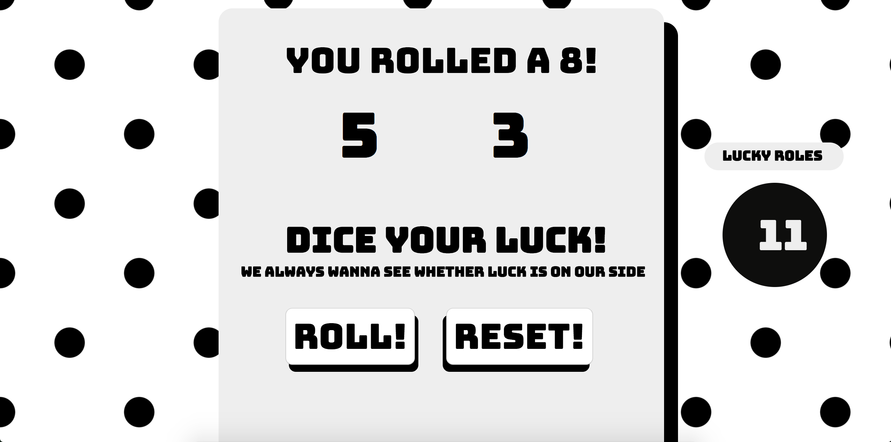

<h1 align="center">
   The Javascript Dice
</h1>



Inspired by the tutorials from CodeAcademy, I wanted to familiarise myself more
with the Javascript syntax and logic by creating several games. Here, one shall be rolling two dices

***

# How to Use

1. Clone the project
```
git clone https://github.com/thatdania/Javascript-Dice.git
```

2. Changes into the project directory on ur computer via Terminal
```
cd Javascript-Dice
```

3. Changes into the views section
```
cd views
```

4. Open dice.html and enjoy!
```
open dice.html
```
5. Refresh the page if you want to reset your lucky rolls to 0!

***

# User stories

```
As A Dice Roller,
So I can roll a dice,
I would like to roll between a 1 and 6
```

```
As A Dice Roller,
So I can roll two dice,
I would like to roll between a 1 and 12
```

```
As A Dice Roller,
So I can know my total scoare from the two dice,
I would like to see the total score for that roll"
```

```
As A Dice Roller,
So I can know when I have good luck,
I would like to be able to count my good luck"
```

```
As A Dice Roller,
So I can play a modern game for the dice,
I would like to design to be practical where I can click a button to roll"
```

```
As A Dice Roller,
So I can roll again,
I would like to reset my roll without changing my lucky rolls"
```

```
As A Dice Roller,
So I can practice my rolling addictively,
I would like to have a sexy interface
```
